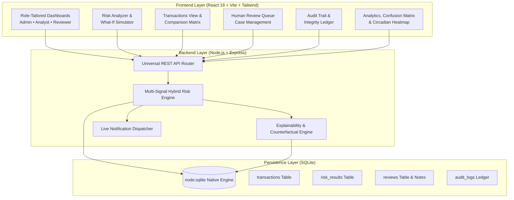

# 🛡️ TransactionGuard AI

> **"Explain Every Risk. Trust Every Decision."**

**Razorpay AI Buildathon 2026 — Track 2: AI Risk Manager**

A defense-only payment transaction risk intelligence platform that analyzes synthetic transactions, scores multi-dimensional risk vectors, explains every contributing factor, and empowers human reviewers with actionable decision support.

---

## 🏛️ Executive Summary

TransactionGuard AI is an explainable payment risk management system engineered for high-throughput fintech payment infrastructure.

Unlike opaque "black-box" fraud scoring tools that simply output binary decisions without justification, TransactionGuard AI follows a strict **defense-only intelligence lifecycle**:

```
DETECT → UNDERSTAND → COMPARE → EXPLAIN → SIMULATE → REVIEW → AUDIT
```

The system evaluates payment telemetry across 5 core biometric and behavioural dimensions, quantifies behavioral anomalies against historical customer baselines, generates counterfactual explanations ("What changes would make this transaction safe?"), and logs every decision into a cryptographically sealed audit ledger.

---

## ⚠️ Defense-Only Compliance Declaration

> **"The system is designed exclusively for fraud detection, risk assessment, explanation, and human-review assistance. It does not automatically block, reverse, cancel, drop, or execute payment actions. It provides intelligence and decision support to authorized human reviewers."**

TransactionGuard AI adheres strictly to the Razorpay AI Buildathon Track 2 safety mandate. Automated execution of transactions is completely avoided; the engine serves as an advisory co-pilot for fraud analysts, risk reviewers, and platform administrators.

---

## 🏗️ System Architecture



---

## 🌟 16 Core Innovations Built

| # | Innovation Module | Capability Description |
|---|---|---|
| 1 | **Behavioral DNA Radar** | 5-axis visualization contrasting current transaction telemetry with historical baseline profile |
| 2 | **What-If Risk Simulator** | Interactive slider sandbox recalculating score deltas live without executing payment changes |
| 3 | **Counterfactual Engine** | Computes minimal parameter adjustments required to transition High/Critical risk into Low risk |
| 4 | **Risk Network Graph** | Canvas graph connecting transaction nodes to linked cards, devices, and merchant nodes |
| 5 | **Evidence Chain** | Chronological timeline of biometric and network telemetry supporting the risk evaluation |
| 6 | **Circadian Risk Heatmap** | 24 Hours × 4 Severity Tiers (Low, Med, High, Crit) temporal distribution grid |
| 7 | **Confusion Matrix & Precision-Recall** | Ground-truth benchmark calculating True/False Positives, Precision, Recall, and F1-Score |
| 8 | **Transaction Comparison** | Side-by-side modal comparing 2 selected transactions with signal divergence highlights |
| 9 | **Audit Integrity Checksum** | Cryptographically sealed audit log with deterministic state root (`● VERIFIED` badge) |
| 10 | **Role-Tailored Dashboards** | 3 customized perspectives for Administrator (KPIs), Analyst (Threats), and Reviewer (Triage) |
| 11 | **Urgent Triage Notification Routing** | Header notification bell navigating directly to target review cases with pre-filtered search |
| 12 | **Interactive Metric Cards** | StatCards with contextual hover cues and direct navigation into filtered transaction views |
| 13 | **Case Management Workflow** | Human review ticketing with `CASE-2026-XXXX`, reviewer notes persistence, and dispositions |
| 14 | **Dynamic AI Risk Brief** | Autonomous executive risk summary synthesizing high-frequency anomalies and merchant spikes |
| 15 | **Graceful Fallback Mode** | Evaluates partial payloads safely with Data Quality Score and explicit limited-data indicators |
| 16 | **Quick/Detailed Intelligence Switch** | Dual-mode inspector for rapid executive screening or deep forensic signal breakdown |

---

## 📊 Risk Engine & Scoring Framework

### Scoring Dimensions (0–100 Scale)

| Telemetry Signal | Weight | Baseline Normal | Anomaly Condition |
|---|---|---|---|
| **Transaction Velocity** | 25% | ≤ 3 tx / hour | High burst rate (e.g. 7–15 tx/hr) |
| **Geolocation Mismatch** | 25% | Domestic origin | IP Country ≠ Merchant Country or high-risk IP |
| **Hardware Device Trust** | 20% | Enrolled device | Unrecognized hardware ID, Tor proxy, emulator |
| **Circadian Time Anomaly** | 15% | 06:00–23:00 | Off-hours payment spike (01:00–05:00) |
| **Amount vs 30d Average** | 15% | 0.5×–2.0× average | Extreme outlier (>5× historical baseline) |

### Risk Tiers & Defense Guidance

- 🟢 **LOW (0–24)**: Pass friction-free. Normal domestic behavior.
- 🟡 **MEDIUM (25–49)**: Step-up authentication advisory (e.g., recommend biometric/OTP verification).
- 🟠 **HIGH (50–74)**: Route to Human Review Queue. Detailed explanation provided to reviewer.
- 🔴 **CRITICAL (75–100)**: Immediate manual triage required. Suspended payout pending reviewer sign-off.

---

## ⚡ Pre-Loaded Buildathon Test Cases

| Scenario | Payload Profile | Primary Anomaly | Expected Outcome |
|---|---|---|---|
| **TX-DEMO-001** | ₹42,500, Velocity: 9/hr, IP: RU, Device: DEV-NEW-001 | Velocity burst + Geo mismatch + New device | **CRITICAL (90+)**, Flagged |
| **TX-DEMO-002** | ₹1,200, Velocity: 1/hr, IP: IN, Device: DEV-KNOWN-001 | Within historical average, domestic, trusted device | **LOW (<20)**, Clean pass |
| **TX-DEMO-003** | ₹18,500, Velocity: 7/hr, IP: IN, Device: Known | Nighttime velocity burst (23:00) | **MEDIUM (40–55)**, Step-up |
| **TX-DEMO-004** | ₹98,000, Velocity: 4/hr, IP: NL, Device: DEV-TOR-PROXY | Tor exit node + 15× amount outlier | **CRITICAL (95+)**, Immediate triage |

---

## 🚀 Quick Start Guide

### Prerequisites
- Node.js 22.5+ (features native `node:sqlite` engine)
- npm

### Installation & Launch

```bash
# Clone repository
git clone <repo-url>
cd TransactionGuard

# Install root, backend, and frontend dependencies
npm install
npm --prefix backend install
npm --prefix frontend install

# Launch backend and frontend concurrently
npm run dev
```

- **Frontend Client**: `http://localhost:5173` (or `5174`)
- **Backend API**: `http://localhost:5000`
- **Health Check**: `http://localhost:5000/api/health`

---

## 🧪 Verification & Production Build

The frontend builds cleanly with Vite:

```bash
cd frontend
npm run build
# ✓ 2344 modules transformed.
# ✓ built in 8.8s
```

All backend endpoints use zero external SQLite driver binaries, ensuring 100% cross-platform portability across Windows, Linux, and macOS via Node.js native SQLite.

---

## 🛡️ Hackathon Submission Details
- **Buildathon**: Razorpay AI Buildathon 2026
- **Track**: Track 2 — AI Risk Manager
- **Product**: TransactionGuard AI
- **Tagline**: *"Explain Every Risk. Trust Every Decision."*
